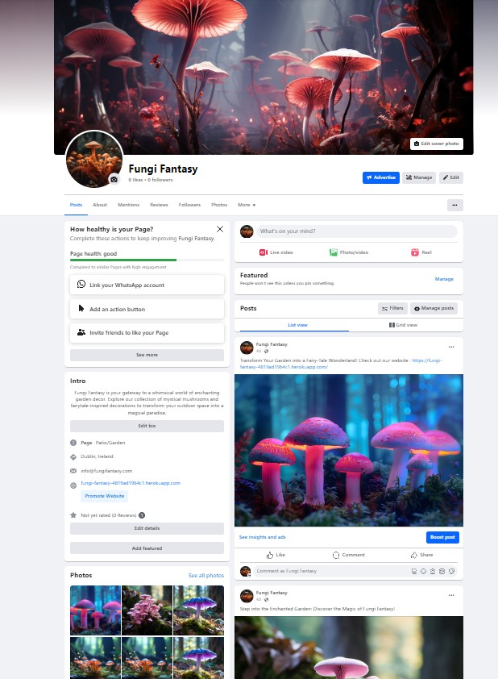

# Fungi Fantasy


Fungi Fantasy is a comprehensive e-commerce platform offering enchanting garden decor. Users can explore and purchase a variety of decorative mushrooms, while also creating personal accounts to track orders and preferences. Administrators have full control to manage products, handle inquiries, and curate an immersive experience for garden enthusiasts.


You can view the live site at **[Fungi Fantasy](https://fungi-fantasy-4819ad1964c1.herokuapp.com/).**


For testing purposes, you can utilize the following Stripe Dummy Card details:
- Success Card Number: 4242 4242 4242 4242
- Expiration Date: Enter any future date using the format MM/YY
- CVV: Enter any 3-digit number
- Postal Code: Enter any 5 numerical digits

Please note that payments made using valid debit/credit cards will not be processed, and the card will not be charged. Additionally, no orders placed will be fulfilled.


## Table of contents

 1. [ UX ](#ux)
    
    **1.4 Wireframes**

    **1.5 Colors**

    **1.6 Database Schema**


 2. [ Features ](#)
 3. [ Marketing ](#marketing-and-seo)  
 4. [ Validatiton ](#) 
 5. [ Manual Testing ](#testing)  
 6. [ Bug ](#bug)  
 7. [ Deployment](#deployment)
 8. [ Tecnologies used](#tecnologies-used)  
 9. [ Credits](#credits)
 10. [ Acknowledgements](#acknowledgements)  

## UX User Experience

### Overview

The purpose of the Fungi Fantasy website is to provide a user-friendly online shop where visitors can explore a variety of products sorted into categories. In addition to browsing product details, users can also view comments and ratings left by other customers to make informed decisions about their purchases.

### Customer objectives

At Fungi Fantasy, customers enjoy a seamless and intuitive shopping journey, where they're inspired to discover extraordinary products to turn their garden into a whimsical fairy tale. Registering an account with Fungi Fantasy grants access to various user features, such as rating or commenting on purchased products. Plus, subscribers receive a monthly newsletter with updates on new arrivals, trends, and cupons.

### Site goals

- Provide users with the convenience of online shopping from the comfort of their home at Fungi Fantasy.
- Allow users to peruse comments from other shoppers regarding products.
- Enable users to add items to their Wishlist for future consideration.
- Empower users to view comprehensive details of each item in the shop, including price, and description.
- Admin Dashboard for business owners. It helps you manage your products, you can quickly make any changes you need.

### Epics and User Stories

In planning our strategy at Fungi Fantasy, we developed 5 main goals, called EPICS, to guide our project. You can find the detailed list of these epics and their links in our project's [Kanban Board](https://github.com/users/Bruna-Andelieri/projects/3). From these epics, we broke down into smaller tasks, called user stories, to make sure we cover everything we need.

List of the EPICS and user stories

**EPIC: VIEW WEBSITE AND USER ACCOUNT**
- As a customer, I can view the site's home page so that I can comprehend the site's objectives and purpose
- As a customer, I have visibility and functionality of the navigation bar to navigate across the site.
- As a customer, I can input text into the search bar to locate a specific item.
- As a visitor, I can register to the website and create an account so that I can save my details and become a customer
- As a customer logged-in, I can update my details within my account to ensure they remain current
- As a customer, I can save my username and password so that I can easily access my details.
- As a visitor I can click on the external links so that I can view relevant information.
- As a visitor, I can enter my email to the newsletter field so that I can receive relevant news about the website.
- 

**EPIC: PRODUCTS AND SHOPPING CART CHECK OUT**
- As a customer, I can click on "All products" so that I can explore all items available on the website.
- As a customer, I can click on a navbar to select a specific method for searching for an item.
- As a customer, I can select an individual product so that I can view its description, price, etc.
- As a customer, I can click on 'Add to Cart' in my product views so that I can add the product to my cart.
- As a customer, I can increase/decrease/remove quantities of a product in my cart so that I can have control over what I wish to purchase.
- As a customer, I can securely check out my products to finalize my purchase.
- As a customer, I can receive an email post-purchase to confirm my order and maintain a record of my purchase.
- As a customer logged in I can see my order history so that I can track my spending and details of purchase

**EPIC: ADMIN MANAGEMENT**
- As an admin, I can log in to the admin panel so that I can manage/see the panel.
- As an admin, I can add edit, or delete products so that I can update the website's products page.
- As an admin, I want to view an order so that I can review what customers are purchasing.

**EPIC CUSTOM MODELS**
- As an admin, I can view the inquiries submitted via the contact form to respond to customer queries.
- As a visitor, I can enter my details on the Contact form so that I can send a message to the company.
- As a user logged in after the purchase I can write a review about the product.
- As a user logged in after the purchase I can rate the product purchased.
- As a logged-in user, I can click the 'Add to Wishlist' button to save my favorite items for future reference.
- As a logged-in user, I can click the 'Remove' icon next to an item on my Wishlist to delete that product.

**EPIC: TESTING AND DOCUMENTATION**
- As a developer, I conduct comprehensive testing across all aspects of my project to ensure users have a seamless experience devoid of errors.
- As a developer, I document all project information in my README.md to provide comprehensive documentation for myself and others.


## Marketing and SEO

#### Marketing

- The Fungi Fantasy website also features a Facebook business page, enabling us to share content with customers and interact with them through comments and messages. You can [click here](https://www.facebook.com/profile.php?id=61558190435969) to visit the Fungi Fantasy Facebook Business Page.




- The website also features a Mailchimp newsletter signup form, allowing us to gather email addresses for marketing purposes. You can find the newsletter form below:


#### SEO (Search Engine Optimization)


Keywords relevant to Fungi Fantasy's business scope were meticulously researched, along with description tags. Wordtracker was employed to ensure the inclusion of both short-tail and long-tail keywords. Furthermore, product names and descriptions were carefully crafted to enhance visibility on search engines like Google. See below some of the words:

- Mushrooms
- Fairytale
- Magical
- Mistic
- Decorative mushrooms
- Garden decor
- Outdoor accessories
- Fairy garden decorations
- Enchanted garden ornaments
- Magical mushroom 

To enhance the site's visibility, it have been created two essential files: sitemap.xml and robots.txt. These files play a crucial role in SEO (Search Engine Optimization). The sitemap.xml, generated with XML Sitemap, is located in the root folder, while the robots.txt guides search engine crawlers on accessing and crawling our site's pages.

## Manual Testing


I conducted manual testing based on my user stories. For a test to pass, it must meet the acceptance criteria. I performed the tests on Google Chrome and Mozilla Firefox.

| User story - As a user, I can...                                                                                             | Notes  | Chrome | Firefox | 
| ---------------------------------------------------------------------------------------------------------------------------- | ------ | :----: | :-----: | 
| **click on "All products"** to **explore all items available on the website.**                                               | Passed |   ✅   |   ✅    |
  **create an account** to **access personalised features and save my preferences**.                                           | Passed |   ✅   |   ✅    |  
| **click on a navbar** to **select a specific method for searching for an item**                                              | Passed |   ✅   |   ✅    |
| **log into my account** to **access my personal settings and history, or prefill my details at checkout**.                   | Passed |   ✅   |   ✅    |   
| **log out of my account** to **ensure my account is secure when I'm not using it**.                                          | Passed |   ✅   |   ✅    |   
| **update my account/profile** to **keep my personal information up to date for checking out**.                               | Passed |   ✅   |   ✅    |   
| **delete my account** to **remove my personal data from the platform**.                                                      | Passed |   ✅   |   ✅    |   
| **access and view my user profile** to **see my personal information, order history, and manage my account settings**.       | Passed |   ✅   |   ✅    |   
| **view a summary of my orders** to **keep track of my purchases** (as a **registered customer**).                            | Passed |   ✅   |   ✅    |   
| **add products to a wishlist** to **save them for future consideration or purchase**.                                        | Passed |   ✅   |   ✅    |  
| **create new products** to **offer more choices to customers** (as a **admin**).                                             | Passed |   ✅   |   ✅    |   
| **update product details** to **ensure all information about the products is current and accurate** (as a **admin**).        | Passed |   ✅   |   ✅    |   
| **delete products** to **remove items that are no longer available or relevant** (as a **admin**).                           | Passed |   ✅   |   ✅    |   
| **add products to my cart** to **purchase them** (as a **customer**).                                                        | Passed |   ✅   |   ✅    |   
| **remove products from my cart** to **manage items before finalizing my purchase** (as a **customer**).                      | Passed |   ✅   |   ✅    |   
| **see an order summary in the cart** to **review my order before completing the purchase** (as a **customer**).              | Passed |   ✅   |   ✅    |   
| **complete the checkout process and pay** to **finalise my order** (as a **customer**).                                      | Passed |   ✅   |   ✅    |   
| **create reviews for products** to **share my experience with others** (as a **logged-in customer**).                        | Passed |   ✅   |   ✅    |   
| **update my reviews** to **modify my feedback if my opinion changes** (as a **logged-in customer**).                         | Passed |   ✅   |   ✅    |   
| **delete my reviews** to **remove my feedback if I no longer wish it to be displayed** (as a **logged-in**).                 | Passed |   ✅   |   ✅    |   
| **enter my details on the Contact form** to **send a message to the company**.                                               | Passed |   ✅   |   ✅    |                                


## Deployment

### ElephantSQL Database
This project uses [ElephantSQL](https://www.elephantsql.com) for the PostgreSQL Database.

To create your Postgres Database, simply sign up with your GitHub account and follow these steps:

- Click on Create New Instance to initiate a new database.
Specify a name for your database (typically the project name, such as "Fungi-Fantasy").
- Choose the Tiny Turtle (Free) plan.
- You can opt to leave the Tags field empty.
- Select the nearest Region and Data Center.
A- fter creation, access your database by clicking on its name, where you'll find the database URL and Password.

### Amazon AWS
This project utilizes  [AWS](https://aws.amazon.com) for storing media and static files online, as Heroku does not retain this data type.

After creating an AWS account and logging in, navigate to the AWS Management Console page and follow these steps to connect your project.

#### S3 Bucket
- Find and select S3.
- Create a new bucket, providing a name typically matching your Heroku app name, and select the region closest to you.
- Disable "Block all public access" and acknowledge that the bucket will be public, as it's required for Heroku operation.
- Ensure ACLs are enabled and select "Bucket owner preferred" under Object Ownership.
- Navigate to the Properties tab, enable static website hosting, and input "index.html" and "error.html" in their respective fields. Save your changes.
- Move to the Permissions tab and paste the following CORS configuration:
```
[
 {
  "AllowedHeaders": [
   "Authorization"
  ],
  "AllowedMethods": [
   "GET"
  ],
  "AllowedOrigins": [
   "*"
  ],
  "ExposeHeaders": []
 }
]
```

- Copy your **ARN** string.
- From the **Bucket Policy** tab, select the **Policy Generator** link, and use the following steps:

- Policy Type: **S3 Bucket Policy**
  - Effect: **Allow**
  - Principal: `*`
  - Actions: **GetObject**
  - Amazon Resource Name (ARN): **paste-your-ARN-here**
  - Click **Add Statement**
  - Click **Generate Policy**
  - Copy the entire Policy, and paste it into the **Bucket Policy Editor**

```
{
 "Id": "Policy1234567890",
 "Version": "2012-10-17",
 "Statement": [
  {
   "Sid": "Stmt1234567890",
   "Action": [
    "s3:GetObject"
   ],
   "Effect": "Allow",
   "Resource": "arn:aws:s3:::your-bucket-name/*"
   "Principal": "*",
  }
 ]
}
```
Before you click "Save", add /* to the end of the Resource key in the Bucket Policy Editor (as shown above).
- Click Save.
#### IAM

- Navigate to IAM by searching for it on the AWS Services Menu. Once on the IAM page, proceed with the following steps:

- Under User Groups, click on Create New Group.
- Suggested Name: group-fungi-fantasy (the group name combined with the project name)
- Tags are optional but must be clicked to access the review policy page.
- Select the newly created group from User Groups and move to the Permissions tab.
- Click on the Add Permissions dropdown and select Attach Policies.
- Choose the desired policy and click Add Permissions at the bottom to finish.
- Under the JSON tab, select the Import Managed Policy link.
```
{
 "Version": "2012-10-17",
 "Statement": [
  {
   "Effect": "Allow",
   "Action": "s3:*",
   "Resource": [
    "arn:aws:s3:::your-bucket-name",
    "arn:aws:s3:::your-bucket-name/*"
   ]
  }
 ]
}
```
- Click on Review Policy.
  - Suggested Name: policy-fungi-fantasy (policy combined with the project name)
   - Provide a description: "Access to S3 Bucket for fungi-fantasy static files."
   - Click Create Policy.
- Under User Groups, select your "group-fungi-fantasy".
- Click Attach Policy.
- Search for the policy you've just created ("policy-fungi-fantasy"), select it, then Attach Policy.
- Under User Groups, click Add User.
- Suggested Name: user-fungi-fantasy (user combined with the project name)
  - For "Select AWS Access Type," choose Programmatic Access.
  - Select the group to add your new user to: group-fungi-fantasy.
  - Tags are optional, but click it to access the review user page.
  - Click Create User once done.
- You should see a button to Download .csv, so click it to save a copy on your system.
***IMPORTANT: Once you pass this page, you cannot come back to download it again, so do it immediately!***
- This contains the user's Access key ID and Secret access key.
  - AWS_ACCESS_KEY_ID = Access key ID
  - AWS_SECRET_ACCESS_KEY = Secret access key.

#### Set up AWS

- If DISABLE_COLLECTSTATIC is still present in Heroku Config Vars, it can now be removed to allow AWS to handle static files.
- In the S3 dashboard, create a new folder named: media.
- Choose existing media images for your project to prepare them for upload into the new folder.
- Under Manage Public Permissions, select Grant public read access to this object(s)
- No further settings are required, so click Upload.

### Stripe API

This project utilizes [Stripe](https://stripe.com) to handle the ecommerce payments.
To integrate your project with Stripe, follow these steps:

- Navigate to your Stripe dashboard and expand "Get your test API keys".
Here you'll find two keys:
   - STRIPE_PUBLIC_KEY = Publishable Key (starts with pk)
  - STRIPE_SECRET_KEY = Secret Key (starts with sk)
As a backup in case users close the purchase-order page during payment, Stripe Webhooks can be included.

- In your Stripe dashboard, go to Developers, then select Webhooks.
- Click Add Endpoint.
- Use the endpoint: https://fungi-fantasy-4819ad1964c1.herokuapp.com/checkout/wh/
- Select receive all events.
- Click Add Endpoint to complete the process.
- You'll receive a new key:
   -STRIPE_WH_SECRET = Signing Secret (Webhook) Key (starts with wh)

### Gmail API
This project utilizes [Gmail](https://mail.google.com) to handle sending emails to users for account verification and purchase order confirmations.
To integrate your project with Gmail, follow these steps:

- Click on the Account Settings (cog icon) in the top-right corner of Gmail.
Go to the Accounts and Import tab.
- Under "Change account settings", select Other Google Account settings.
- On the new page, choose Security from the left sidebar.
- Turn on 2-Step Verification. (verify your password and account)
- After verification, turn on 2FA.
- Return to the Security page and find App passwords.
- Confirm your password and account again if prompted.
- Select Mail for the app type.
- Choose Other (Custom name) for the device type.
- Use any custom name, like "Django" or "fungifantasy"
- You'll receive a 16-character password (API key).
- Save this securely, as it can't be accessed later!
  - EMAIL_HOST_PASS = user's 16-character API key
  - EMAIL_HOST_USER = user's personal Gmail email address

### Heroku


This project utilizes [Heroku](https://www.heroku.com), a platform as a service (PaaS) that empowers developers to build, run, and manage applications entirely in the cloud.
Follow these deployment steps after setting up your account:

- Navigate to your Heroku Dashboard and click New in the top-right corner, then select Create new app.
- Choose a unique app name, select a region (EU or USA), and click Create App.
- In the app's Settings, click Reveal Config Vars, and set the following environment variables:

| Key                     | Value                                                                |
| ----------------------- | -------------------------------------------------------------------- |
| **AWS_ACCESS_KEY_ID**     | user's own value                                                     |
| **AWS_SECRET_ACCESS_KEY** | user's own value                                                     |
| **DATABASE_URL**          | user's own value                                                     |
| **DISABLE_COLLECTSTATIC** | 1 (_this is temporary, and can be removed for the final deployment_) |
| **EMAIL_HOST_PASS**       | user's own value                                                     |
| **EMAIL_HOST_USER**       | user's own value                                                     |
| **SECRET_KEY**            | user's own value                                                     |
| **STRIPE_PUBLIC_KEY**     | user's own value                                                     |
| **STRIPE_SECRET_KEY**     | user's own value                                                     |
| **STRIPE_WH_SECRET**      | user's own value                                                     |
| **USE_AWS**               | True                                                                 |

Heroku needs two additional files in order to deploy properly.

- requirements.txt
- Procfile

You can install this project's **requirements** (where applicable) using:

- pip3 install -r requirements.txt

If you have your own packages that have been installed, then the requirements file needs updated using:

- pip3 freeze --local > requirements.txt

The **Procfile** can be created with the following command:

- echo web: gunicorn app_name.wsgi > Procfile
- _replace **app_name** with the name of your primary Django app name; the folder where settings.py is located_

For Heroku deployment, follow these steps to connect your own GitHub repository to the newly created app:

Either:

- Select **Automatic Deployment** from the Heroku app.

Or:

- In the Terminal/CLI, connect to Heroku using this command: heroku login -i
- Set the remote for Heroku: heroku git:remote -a app_name (replace _app_name_ with your app name)
- After performing the standard Git `add`, `commit`, and `push` to GitHub, you can now type:
  - git push heroku main

Your project is now successfully connected and deployed on Heroku!

### Cloning Project

A local clone of this repository can be made on GitHub. Please follow the below steps:

- Navigate to GitHub and log in.
- The [Fungi Fantasy Repository](https://github.com/Bruna-Andelieri/FungiFantasy) can be found at this location.
- Above the repository file section, locate the 'Code' button.
- Click on this button and choose your clone method from HTTPS, SSH, or GitHub CLI, copy the URL to your clipboard by clicking the 'Copy' button.
- Open your Git Bash Terminal.
- Change the current working directory to the location you want the cloned directory to be made.
- Type git clone and paste in the copied URL from step above.
- Press 'Enter' for the local clone to be created.
- Use the **pip3 install -r requirements.txt** command to install the dependencies and libraries needed for Fungi Fantasy.
- Set up your env.py file and gather the PostgreSQL URL from ElephantSQL, if applicable, and add your SECRET_KEY and STRIPE/AWS keys if using these services.
- Ensure that your env.py file is placed in your .gitignore file and follow the remaining steps in the Django Project Setup section before pushing your code to GitHub.

### Forking Project

You can create a copy of the original repository on GitHub by following these steps:

- Log in to GitHub.
- Visit the [Fungi Fantasy Repository](https://github.com/Bruna-Andelieri/FungiFantasy).
- Click the 'Fork' button at the top right of the repository page to make a copy in your own GitHub account.

You will now have a forked version of the repository in your GitHub account. 

## Tecnologies Used
#### Languages

- HTML
- CSS
- JavaScript
- Python 

#### Frameworks and Libraries

- Django
- Bootstrap
- jQuery
- Stripe

#### Development and Deploy

- Heroku
- Git
- GitHub
- VsCode

## Credits

- [**Google Fonts**](https://fonts.google.com/)  - utilized for selecting the perfect typography
- [**AWS**](https://aws.amazon.com/) - employed as a storage solution for static and media files
- [**FavIcon.io**](https://favicon.io/favicon-converter/)  - utilized for compressing favicons
- [**FreePik**](https://www.freepik.com/)  - serves as a database for images
- [**Google Fonts**](https://fonts.google.com/)  - employed for selecting the best typography
-  [**W3Schools**](https://www.w3schools.com/) - provides useful information and cheat sheets
- [**Code Institute**](https://github.com/Code-Institute-Org>) Boutique Ado  walkthroughs
- [**XML-Sitemaps.com**](https://www.xml-sitemaps.com/)  - utilized for generating XML sitemaps
- [**Coolors**]((https://coolors.co/)) for color palette


## Acknowledgements


Completing this final project brings me immense joy...
Code Institute has been an invaluable source of support and guidance throughout the development journey, from my mentor Rohit Sharma to the helpful Slack community, my cohort and colleagues.

I owe a debt of gratitude to my partner, Ivan, whose coding expertise and unwavering belief in me have been instrumental in my journey into software development. His support has been crucial to the success and completion of this project, and I am truly thankful for his contributions.